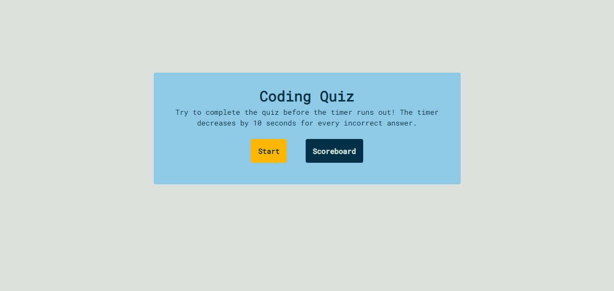
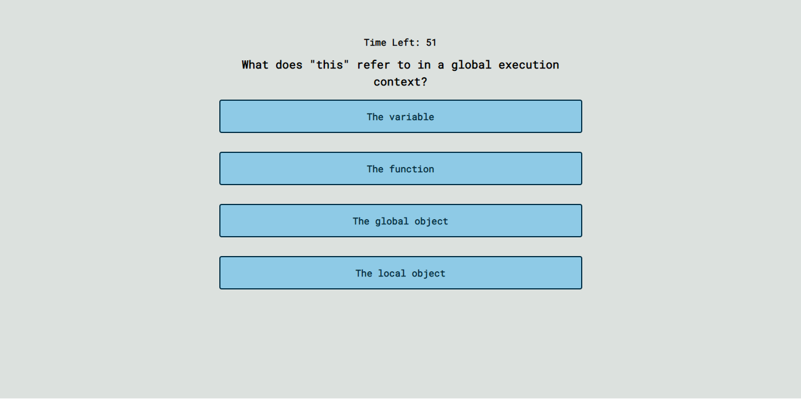
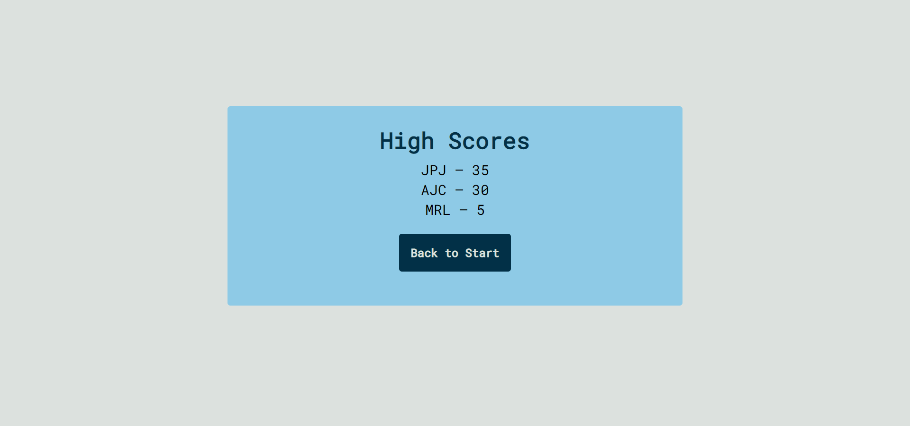

# Code Quiz

[Live Site](https://mycancel.github.io/code-quiz/)

## Table of Contents

- [Description](#description)
- [Visuals](#visuals)
- [Authors and Ackowledgements](#authors-and-acknowledgements)

## Description

This code quiz has four states: the start screen, the quiz, the end screen, and the scoreboard. Using JavaScript, the sections are displayed in sequence at the press of a button. A 60 second timer runs once the quiz starts. During the quiz, correct answers are rewarded with by displaying "Correct" on the screen while incorrect answers display "Incorrect" and reduce the timer. At the end of the quiz, the user can input their initials to be added to their score displayed on the high scores page. 

## Visuals







## Authors and Acknowledgements

The functions ```displayState()``` and ```init()``` were jumpstarted by the class instructor, Anthony Cooper. My additions to these functions were the function calls within ```displayState()```.